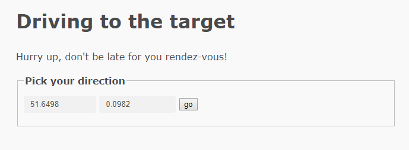

# ctf-writeups


This is marked as a coding challenge even though I'm not a coder I'll give it a shot anyway.
Upon clicking the link we are presented with a simple UI with two separate number fields asking us to pick our direction.




If we click "go" with the default numbers in the field it presents this message.


it also changes the URL to the following

https://drivetothetarget.web.ctfcompetition.com/?lat=51.6498&lon=0.0982&token=gAAAAABdF2b0Jo520OKQFtMfWtti_dHO7rVpyljaU3v74xht1RqH6PmdxJ1BIAPCfPbYxGMX4PYrMJ6T_YLmAoIRZ37We7jRUs5IhkGpEWSRFuoCnJRohdOHAe3F_xqB_DpDphQMCVyN

This is interesting, you can see 3 parameters in the URL, lat, lon and token.
lat and lon are obviously referring to latitude and longitude, not sure what the token is but we will come back to that later.

I then try increasing the lat by 1


Increasing Lat by a whole degree "moves" us about 111km seems there is a limit on how fast we can move.
lets try increasing it by a single second.


That worked but in the wrong direction, let’s try reducing latitude by one second.


Perfect we are heading in the right direction.
We now know the basics of how this website works, so let’s try modifying the token sent in the URL see what happens.


After playing with the token it appears the token is used to authenticate the other parameters that are sent in the URL, this means to capture this flag we will have to crack how the token is made or take lots of small steps, I chose to go with making lots of small steps, let’s get to coding.

Since I know a little bit of bash I go with that.
```
#!/bin/bash

lat="51.6498"
long="0.0982"
token="gAAAAABdF4snizIqQI5K7N7yPOZ6bUhrl3j3C5kH-wG2UMEnncN4t42QAhn0SPyJxZE1H_zsDlvj38-RI-1RFKf6450IqIx9Kmj9DbI3FQzw-tsNe6O5ZQ-DVaYrbhTc-FkRCSaV4tQ7"


while true; 
do
	
curl 'https://drivetothetarget.web.ctfcompetition.com/?lat='$lat'&lon='$long'&token='$token'' > reply 
token="`cat reply | grep -Po '(?<=name="token" value=").*$' | rev | cut -c 3- | rev`"
lat=$(echo "$lat+0.0002" | bc)
#lat=$(echo "$lat-0.0002" | bc)
#long=$(echo "$long+0.0004" | bc)
#long=$(echo "$long-0.0004" | bc)
cat reply | grep "<p>" >> log
echo "new lat is" $lat >> log
echo "new long is" $long >> log
echo "token is" $token >> log
sleep 1.3

done
```
It's not pretty but it does the job.

I use some regex to pull the token from the response from the server and then input it into the next curl command, you could also extract the lat and long from the server's response, but I just handled that manually.

I then either increase or decrease the lat and/or lon based on what's commented out at the time, I must pipe the lat and lon into bc because bash doesn't handle floats very well.

This code by itself would never find the flag, but by outputting its progress and variables to a log file I can manually tweak the code once I see the output change from "you are getting closer" to "you are getting away"

In total it took 5 manual interventions with the code to change its direction and about about 2 hours it reached the flag. 

https://drivetothetarget.web.ctfcompetition.com/?lat=51.4921&lon=-0.1928&token=gAAAAABdDhx0H40ears2fEI7wIwWHYl6K0dgFHIZHPxelceIsRyXsle_sPZUsGwsTHF12svh9RncEhx1e7dupA8z_q5N4714prD_ULYOT7f4CEHiHdWSiAWMkZwlbfv66HDK6NM5-iH6

CTF{Who_is_Tardis_Ormandy}


